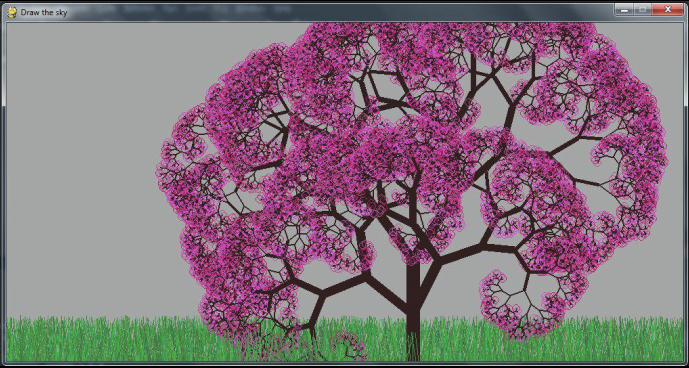

# simple_draw

Pygame-based package for drawing graphical primitives for tutorial purpose.

​

#### Changelog

#### 2.8.0
* ADD py310 support
* ADD pygame 2.1 support

#### 2.7.0
* ADD py39 support
* ADD pygame 2.0 support

#### 2.6.8
* ADD py38 support
* DROP py27 support 

#### 2.6.7
* small fix: duplicate assert

#### 2.6.6
* more calls _init() in low level functions
* add take_background and draw_background

#### 2.6.5
* added take_snapshot

#### 2.6.4
* budfix pygame init in start_drawing
* move vector width to .draw()

#### 2.6.3
* added width for lines

#### 2.6.2
* added quit()

#### 2.6.0
* added support for line/vector width 
* set up resolution